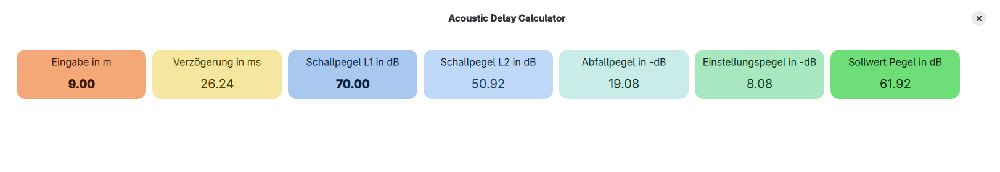

<!-- <h1 style="display: flex; align-items: center; border-bottom: none;">
  
  <span style="vertical-align: middle;">Sdalcal</span>
</h1>-->

<p align="center">
  
</p>

<h1 align="center" style="font-size: 5em; border-bottom: none;">
  <strong>Sdalcal</strong>
</h1>

<!-- # Sounddelay-and-Level-Calculator -->


Sdalcal stands for "Sounddelay-and-Level-Calculator" and calculates the sounddelay between two louspeaker positions with a given distance and the soundlevel for the second loudspeakers.



Hint:

- Sound pressure level ≠ sound intensity level
- L2=L1-20*log(r1/r2)
- L2=L1-10*log(r1/r2)²

#### References

1. Sengpielaudio: <https://sengpielaudio.com/Rechner-SchallUndEntfernung.htm>

## Project Requirements

This Project was created with the Slint GUI Framework.
For this project you need:

- Rust Compiler
- Cargo package manager

Installation (with rustup):
```sh
curl --proto '=https' --tlsv1.2 -sSf https://sh.rustup.rs | sh
```


Checkout the documentation of slint framework: \
https://docs.slint.dev/latest/docs/slint/

#### Install Build Essentials

For Debian, Ubuntu, Mint:

```bash
# Install dependencies
sudo apt update && sudo apt install -y \
    build-essential \
    git \
    curl \
    pkg-config \
    libfontconfig1-dev \
    libx11-dev \
    libxkbcommon-dev \
    libgl1-mesa-dev \
    libegl1-mesa-dev \
    libwayland-dev

# Install Rust Toolchain
curl --proto '=https' --tlsv1.2 -sSf https://sh.rustup.rs | sh -s -- -y
```

For Fedora:

```bash
# Install dependencies
sudo dnf install -y \
    git \
    curl \
    pkg-config \
    fontconfig-devel \
    libX11-devel \
    libxkbcommon-devel \
    mesa-libGL-devel \
    mesa-libEGL-devel \
    wayland-devel

# Install Rust Toolchain
curl --proto '=https' --tlsv1.2 -sSf https://sh.rustup.rs | sh -s -- -y
```
